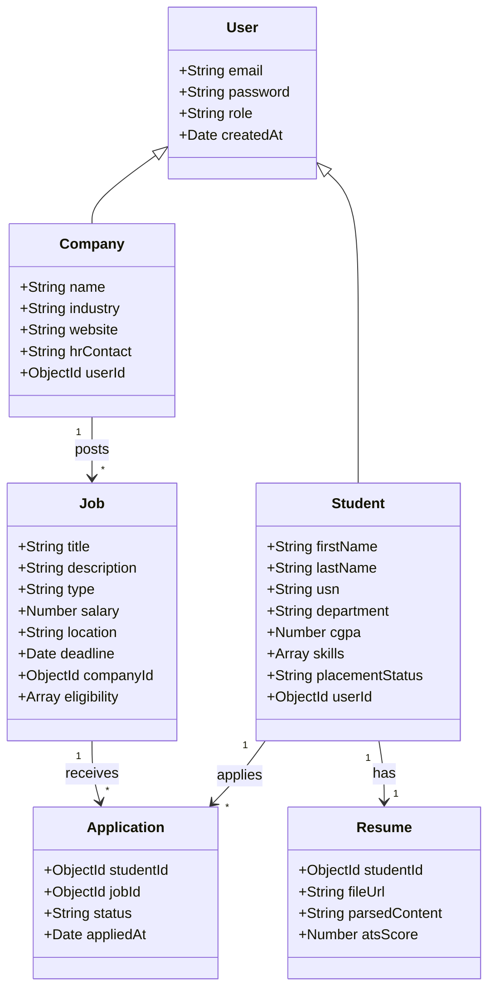
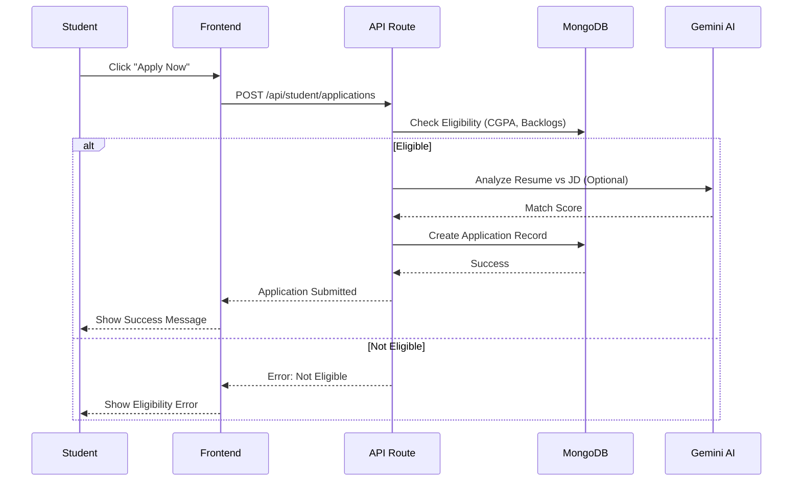
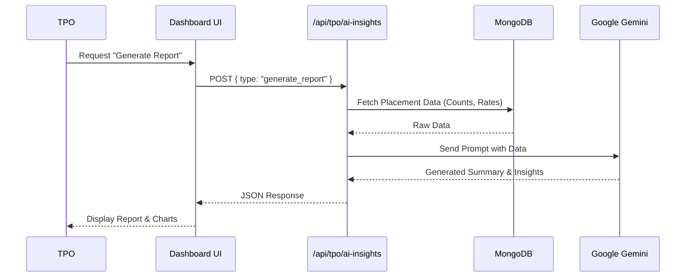
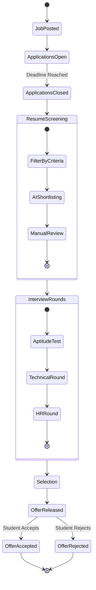

# UML Diagrams for Campus Placement Management System

## 1. System Architecture Diagram

This diagram illustrates the high-level architecture of the application, including the frontend, backend API, database, and external AI services.

```mermaid
graph TD
    subgraph Client_Side
        Browser[Web Browser]
        NextJS_Client[Next.js Client Components]
    end

    subgraph Server_Side
        NextJS_Server[Next.js Server Actions / API Routes]
        Auth[Authentication (NextAuth/Custom)]
        Gemini_Integration[Google Gemini Integration]
    end

    subgraph Database
        MongoDB[(MongoDB Atlas)]
    end

    subgraph External_Services
        Google_Gemini_API[Google Gemini API]
        Email_Service[SMTP / Email Service]
    end

    Browser -->|HTTP/HTTPS| NextJS_Server
    NextJS_Client -->|Fetch API| NextJS_Server
    NextJS_Server -->|Mongoose| MongoDB
    NextJS_Server -->|AI SDK| Google_Gemini_API
    NextJS_Server -->|Nodemailer| Email_Service
    NextJS_Server -->|Verify| Auth
```

## 2. Use Case Diagram

This diagram depicts the interactions between the primary actors (Student, TPO, Company) and the system's use cases.

```mermaid
usecaseDiagram
    actor Student
    actor TPO as "Training & Placement Officer"
    actor Company as "Company HR"

    package "Placement System" {
        usecase "Login/Register" as UC1
        usecase "Manage Profile" as UC2
        usecase "View Jobs" as UC3
        usecase "Apply for Job" as UC4
        usecase "Upload Resume" as UC5
        usecase "View AI Insights" as UC6
        
        usecase "Manage Students" as UC7
        usecase "Manage Companies" as UC8
        usecase "Post Jobs" as UC9
        usecase "Schedule Interviews" as UC10
        usecase "Generate Reports" as UC11
        usecase "Configure Policies" as UC12
        
        usecase "Shortlist Candidates" as UC13
        usecase "Send Offers" as UC14
    }

    Student --> UC1
    Student --> UC2
    Student --> UC3
    Student --> UC4
    Student --> UC5
    Student --> UC6

    TPO --> UC1
    TPO --> UC7
    TPO --> UC8
    TPO --> UC9
    TPO --> UC10
    TPO --> UC11
    TPO --> UC12
    TPO --> UC6

    Company --> UC1
    Company --> UC9
    Company --> UC13
    Company --> UC14
```

## 3. Class Diagram

This diagram represents the data models and their relationships, based on the MongoDB schemas.



## 4. Sequence Diagram: Student Application Flow

This diagram details the sequence of operations when a student applies for a job.



## 5. Sequence Diagram: TPO AI Insights Generation

This diagram shows how the TPO generates AI-driven insights and reports.



## 6. Activity Diagram: Placement Drive Process

This diagram outlines the workflow of a typical placement drive.


